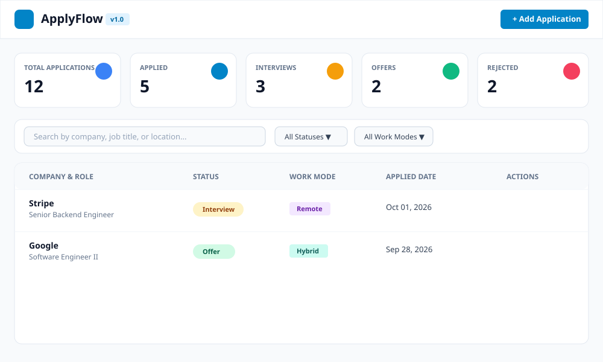
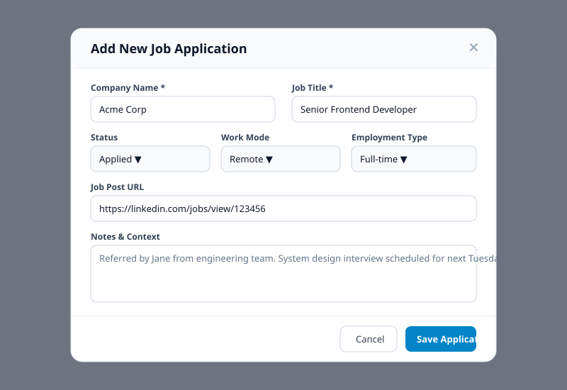
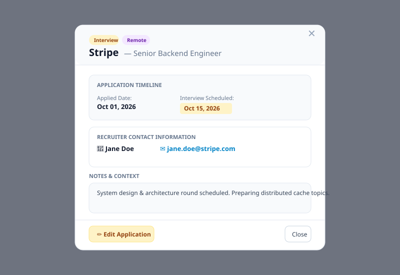

# ApplyFlow — Full-Stack Job Application Tracker

ApplyFlow is a modern, responsive full-stack MERN (MongoDB, Express.js, React.js, Node.js) application designed to help job seekers manage their job search pipeline, monitor application status progression, track recruiter contacts, record interview and follow-up deadlines, filter records, view dashboard analytics, and export application history to CSV.

---

## Features

- **Pipeline Dashboard**: Interactive stat cards displaying total applications, status breakdown (Applied, Interview, Offer, Rejected), upcoming interview dates, offer counts, and overdue follow-up alerts.
- **Full CRUD Operations**: Add, view details, edit, quick-update status, and delete job applications with confirmation modals.
- **Smart Search & Filters**: Search across company, job title, location, and notes with multi-select filtering for work mode (Remote, Hybrid, In-office) and application status.
- **Sorting & Pagination**: Validated server-side pagination and sorting by applied date, follow-up date, company name, or status.
- **CSV Export**: Export visible or filtered application data directly to a clean CSV file with quote-escaping for commas, quotes, and line breaks.
- **Responsive Layout**: Designed for mobile, tablet, and desktop viewing with toggleable Table and Card Grid views.
- **Input Validation & Security**: Server-side Zod input validation, Mongoose ObjectId sanitization, Helmet HTTP security headers, CORS origin restrictions, and request rate limiting.
- **Self-Contained Automated Tests**: Automated backend integration testing using Node's test runner and Supertest with `mongodb-memory-server`, plus Vitest and React Testing Library frontend unit tests.

---

## Tech Stack

- **Frontend**: React 18, Vite, Tailwind CSS, Lucide React icons, Axios, React Router DOM.
- **Backend**: Node.js (v20+ / v24), Express.js, Mongoose ODM, MongoDB (Atlas / Local / Memory server).
- **Validation & Security**: Zod, Helmet, CORS, Express Rate Limit.
- **Testing & Quality**: Supertest, Node Test Runner (`node:test`), Vitest, React Testing Library, ESLint.

---

## Project Structure

```text
applyflow/
├── client/                          # React Frontend (Vite + Tailwind CSS)
│   ├── src/
│   │   ├── components/              # Reusable UI Components
│   │   │   ├── Navbar.jsx
│   │   │   ├── StatsOverview.jsx
│   │   │   ├── SearchFilterBar.jsx
│   │   │   ├── ApplicationTable.jsx
│   │   │   ├── ApplicationCard.jsx
│   │   │   ├── ApplicationFormModal.jsx
│   │   │   ├── ApplicationDetailModal.jsx
│   │   │   ├── DeleteConfirmModal.jsx
│   │   │   ├── StateViews.jsx
│   │   │   └── Toast.jsx
│   │   ├── pages/
│   │   │   └── Dashboard.jsx        # Main Dashboard Page
│   │   ├── hooks/
│   │   │   └── useApplications.js   # Application Pipeline State Hook
│   │   ├── lib/
│   │   │   └── api.js               # Centralized Axios API Module
│   │   ├── utils/
│   │   │   ├── csvExport.js         # CSV Exporter with Field Escaping
│   │   │   └── formatters.js        # Date & Status Formatting Utilities
│   │   ├── App.jsx
│   │   ├── main.jsx
│   │   └── index.css
│   ├── .env.example
│   ├── vite.config.js
│   └── package.json
├── server/                          # Express Backend REST API
│   ├── src/
│   │   ├── config/
│   │   │   └── db.js                # MongoDB Mongoose Connection Handler
│   │   ├── models/
│   │   │   └── Application.js       # Mongoose Application Schema & Indexes
│   │   ├── controllers/
│   │   │   ├── applicationController.js
│   │   │   └── statsController.js
│   │   ├── routes/
│   │   │   ├── applicationRoutes.js
│   │   │   └── healthRoutes.js
│   │   ├── middleware/
│   │   │   ├── errorMiddleware.js   # Centralized Error & 404 Handlers
│   │   │   └── rateLimiter.js       # Rate Limiting Middleware
│   │   ├── validators/
│   │   │   └── applicationValidator.js # Zod Schemas & ObjectId Validator
│   │   ├── app.js                   # Express Application Configuration
│   │   └── server.js                # Server Entry Point
│   ├── tests/
│   │   ├── health.test.js
│   │   └── application.test.js      # Supertest Integration Tests
│   ├── .env.example
│   └── package.json
├── docs/                            # Documentation
│   ├── ARCHITECTURE.md
│   └── API.md
├── .gitignore
├── package.json                     # Workspace Root Package Runner
└── README.md
```

---

## Prerequisites

- **Node.js**: v20.0.0 or higher (v24 supported)
- **npm**: v9.0.0 or higher
- **MongoDB**: A running MongoDB instance (Local service `mongodb://127.0.0.1:27017` or MongoDB Atlas cloud connection URI).

---

## Environment Setup

### 1. Backend Configuration (`server/.env`)
Copy the example environment file in `server/`:

```bash
cd server
cp .env.example .env
```

`server/.env`:
```env
PORT=5000
MONGO_URI=mongodb://127.0.0.1:27017/applyflow
CLIENT_ORIGIN=http://localhost:5173
NODE_ENV=development
```

### 2. Frontend Configuration (`client/.env`)
Copy the example environment file in `client/`:

```bash
cd client
cp .env.example .env
```

`client/.env`:
```env
VITE_API_BASE_URL=http://localhost:5000/api
```

---

## Installation & Running Locally

### Install Dependencies
Run from the root directory to install both client and server dependencies:

```bash
# Install root, server, and client dependencies
npm install
```

Or install in each directory individually:
```bash
cd server && npm install
cd ../client && npm install
```

### Start Services

Open two terminal windows:

**Terminal 1 — Backend Express Server:**
```bash
cd server
npm run dev
```
*Backend listens at `http://localhost:5000`. Verify status at `http://localhost:5000/api/health`.*

**Terminal 2 — Frontend React App (Vite):**
```bash
cd client
npm run dev
```
*Frontend runs at `http://localhost:5173`.*

---

## Testing & Verification Commands

### Execute Backend Tests (Node Test Runner + Supertest)
```bash
cd server
npm test
```
*Executes 9 automated integration tests covering health check, CRUD operations, Zod validation failures, enum validation, ObjectId errors, search filtering, and statistics aggregation.*

### Execute Frontend Tests (Vitest + React Testing Library)
```bash
cd client
npm test
```
*Executes unit and component tests for CSV field escaping and modal validation.*

### Execute Code Linting
```bash
# Server ESLint
cd server && npm run lint

# Client ESLint
cd client && npm run lint
```

### Execute Production Build
```bash
cd client
npm run build
```

---

## API Summary & Quick Examples

### Endpoints Overview

| Method | Endpoint | Description |
|---|---|---|
| `GET` | `/api/health` | Service & DB status check |
| `GET` | `/api/stats` | Dashboard metric counts |
| `GET` | `/api/applications` | Paginated, searchable & filtered list |
| `GET` | `/api/applications/:id` | Single application details |
| `POST` | `/api/applications` | Create application |
| `PUT` | `/api/applications/:id` | Update application |
| `DELETE` | `/api/applications/:id` | Delete application |

### Example Create Request (`POST /api/applications`)
```bash
curl -X POST http://localhost:5000/api/applications \
  -H "Content-Type: application/json" \
  -d '{
    "company": "Google",
    "jobTitle": "Software Engineer II",
    "jobUrl": "https://careers.google.com/jobs/123",
    "location": "Mountain View, CA",
    "workMode": "Hybrid",
    "employmentType": "Full-time",
    "status": "Applied",
    "recruiterName": "Alex Chen",
    "recruiterEmail": "alex@google.com",
    "notes": "Referred by college alumni."
  }'
```

---

## UI Screenshots & Visual Guide


*Figure 1: ApplyFlow Pipeline Dashboard displaying status metric cards, search/filter bar, and application table view.*


*Figure 2: Add/Edit Job Application Modal form with status dropdowns, work mode selectors, dates, and recruiter contact fields.*


*Figure 3: Application Detailed View presenting timeline breakdown, recruiter contacts, notes, and action buttons.*

---

## Known Limitations & Version 1 Scope

> [!IMPORTANT]
> **Single-User / Unauthenticated Prototype Limitation**
> ApplyFlow Version 1.0 is built strictly as a **single-user, unauthenticated technical prototype**. 
> 
> - **No User Authentication**: Features such as user registration, login, passwords, session management, and JWT/OAuth tokens are **not implemented** in Version 1.0.
> - **No Per-User Data Isolation**: All job application records stored in MongoDB reside in a single global database collection. Every client accessing the application sees and interacts with the exact same data pipeline.
> - **Security Advisory**: Do not deploy this application publicly or store real sensitive personal information without implementing an authentication & authorization layer.

### Version 2 Roadmap
- Implementation of multi-tenant user authentication (JWT / OAuth2 / NextAuth).
- Per-user data isolation and row-level access control.
- Automated interview email notifications and calendar integration (.ics export).
- Drag-and-drop Kanban board view for status updates.

---

## GitHub Repository Publication Instructions

### Scenario A: First-time setup on a fresh clone
```bash
# 1. Initialize Git repository
git init

# 2. Add files and make initial commit
git add .
git commit -m "feat: initial commit of ApplyFlow job application tracker"

# 3. Add remote and push
git remote add origin https://github.com/YOUR_USERNAME/applyflow.git
git branch -M main
git push -u origin main
```

### Scenario B: Existing repository with remote configured
If Git is already initialized or a remote `origin` exists:

```bash
# 1. Check existing remote configuration
git remote -v

# 2. Update remote URL if needed
git remote set-url origin https://github.com/YOUR_USERNAME/applyflow.git

# 3. Commit recent changes and push
git add .
git commit -m "feat: update ApplyFlow application"
git branch -M main
git push -u origin main
```

---

## AI Development Tool Disclosure & Usage Log

**Primary AI Development Tool:** Code0 (VS Code Extension) / Antigravity AI Pair Programmer

### Usage Log

| Date | Task Prompt Asked | What AI Tool Suggested | Developer Changes / Rejections | How Verified |
|---|---|---|---|---|
| 2026-10-09 | Review input validation, URL scheme & security edge cases | Zod validation for body/query params, Helmet security headers, rate limiting, and regex escaping for search query `q`. | Added `escapeRegex()` metacharacter escaping, max 100 character limit on `q`, and restricted `jobUrl` protocol to `http://` / `https://`. | Executed `npm test` (12 server tests passed including regex escaping & `jobUrl` scheme tests). |
| 2026-10-09 | Debug frontend-to-API integration & modal state | Centralized Axios API module (`client/src/lib/api.js`), custom `useApplications` hook, and modal handlers. | Added double-quote CSV field escaping (`""`) in `csvExport.js` for fields with commas or newlines. | Verified CSV download and form submission in browser. |
| 2026-10-09 | Review health check endpoint readiness logic | Returning HTTP 200 with status `"ok"` when connected to MongoDB. | Modified `healthRoutes.js` to return HTTP 503 Service Unavailable when MongoDB is disconnected to distinguish liveness from readiness. | Tested `GET /api/health` with connected (200) and disconnected (503) database states. |
| 2026-10-09 | Configure ESLint 9 & Vitest testing dependencies | Flat ESLint config and Vitest JSdom environment. | Installed `@testing-library/dom` peer dependency and added `globals.browser` + JSX parser settings to `eslint.config.js`. | Executed `npm run lint` and `npx vitest run` (0 errors, 6 client tests passed). |
| 2026-10-09 | Review responsive layout & workspace scripts | Root package workspace runner scripts and Tailwind CSS layout. | Added standard workspace commands (`npm test`, `npm run lint`, `npm run build:client`) in root `package.json`. | Executed `npm test`, `npm run lint`, and `npm run build:client` from root (18 total tests passed). |
