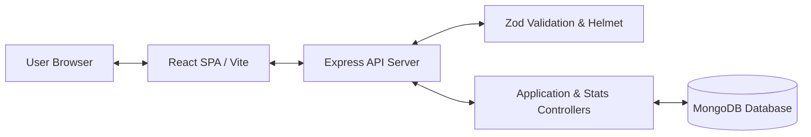

# ApplyFlow Architecture Document

## Overview
ApplyFlow is a full-stack job application tracking system designed using modern MERN principles. It features a responsive React single-page application built with Vite and Tailwind CSS, communicating over a RESTful Express.js HTTP API with MongoDB persistent storage.

> [!NOTE]
> **Scope Notice**: ApplyFlow Version 1.0 is an unauthenticated single-user prototype. All CRUD requests operate on a global MongoDB dataset without user authentication or tenant isolation.

## Architectural Layers

### 1. Presentation Layer (`client/`)
- **Framework**: React 18 with Vite for ultra-fast HMR and bundle compilation.
- **Styling**: Tailwind CSS with utility-first layout design and accessible contrast standards.
- **Icons**: Lucide React for consistent UI state indicators.
- **State Management**: Centralized custom React hook (`useApplications`) managing pipeline state, filtering, modal state, pagination, and toast feedback.
- **API Communication**: Isolated Axios HTTP module (`client/src/lib/api.js`) with request/response interceptors and error handling.

### 2. Service & Router Layer (`server/`)
- **Runtime**: Node.js v24 / v20+ with ES Modules.
- **Web Framework**: Express.js with modular controller-route separation.
- **Security & Middleware**:
  - `helmet`: HTTP header security sanitization.
  - `cors`: Restricted cross-origin resource sharing to configured client origin.
  - `express-rate-limit`: Rate limiting on public API endpoints (300 requests per 15 minutes).
  - `zod`: Request body & query parameter schema validation.
  - Centralized error handler hiding stack traces in production.

### 3. Data & Storage Layer (`server/src/models/`)
- **ORM/ODM**: Mongoose with strict schema typing and indexes.
- **Database**: MongoDB (Atlas or local instance) with Mongoose model validation, default values, date processing, and text indexing on company and jobTitle fields.

## Data Flow Diagram

